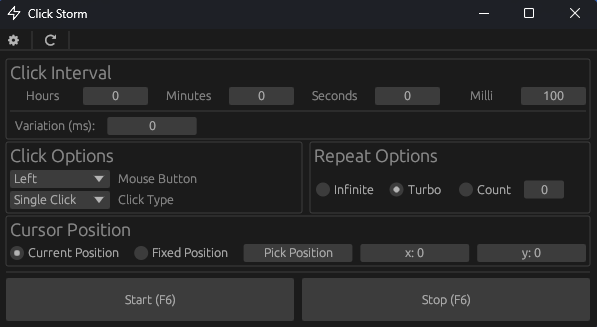

# Click Storm

Click Storm is an open-source auto-clicker written in Rust.



## Notes

The application uses OS threads to perform work. While the timing may not be 100% accurate, it tries to be as close as possible. The location picker and clicking only works on the main display due to library limitations.

### Dependencies

Linux users may need to install `libxdo-dev` to run the application.

### Device Permissions

Some devices may prevent hardware access due to permissions, see this [permissions](https://github.com/enigo-rs/enigo/blob/main/Permissions.md) page if you have issues.

### Translations

The fluent `ftl` files are in the `locales` folder under their respective language codes. They were translated from english using AI so they are probably wrong, feel free to submit a PR with corrections.

## Antivirus Notes

> [!NOTE]
> Windows Security currently marks the executable as having `Trojan:Script/Wacatac.B!ml` which is a false positive. I have submitted a request to get flag removed, however it will take some time.

When running the file through [VirusTotal](https://www.virustotal.com/), a few of the engines may flag the file as malicious. This is most likely because the application can take control of the mouse and perform hardware actions automatically. Input manipulation is generally a red-flag in the context of device security, however it is the core functionality of Click Storm as an auto-clicker.

## Building

 Install [rust](https://www.rust-lang.org/tools/install)

- Open a terminal in the repository location
  - Most operating systems have an option to open a terminal in the current folder when right clicking in blank space within the file browser.
- Enter ```cargo build --release``` to build but not execute, ```cargo run --release``` to build and execute
  - The ```--release``` flag can be removed to build the debug version
  - The binary will be located in `target/release/` or `target/debug/` depending on which version was built.

### Linux

In some cases, linux may also require the following dependencies:

- egui: `sudo apt-get install -y libclang-dev libgtk-3-dev libxcb-render0-dev libxcb-shape0-dev libxcb-xfixes0-dev libxkbcommon-dev libssl-dev`
- enigo: `sudo apt install -y libxdo-dev`
- device_query: `sudo apt-get install -y libx11-dev`

### Documentation

```cargo doc --workspace --no-deps```

## Testing

### Unit/Integration Tests

```cargo test --workspace```

### MIRI

See [miri repository](https://github.com/rust-lang/miri).

- Install the nightly toolchain with ```rustup toolchain install nightly```
- Install miri component on rust nightly: ```rustup +nightly component add miri```
- Run tests with miri: ```cargo +nightly miri test --workspace```
- Run application with miri: ```cargo +nightly miri run```
  - This takes a long time to run and currently fails due to an unsupported operation in `winit`.

## Attributions

Zap icon from [Feather Icons](https://feathericons.com/).
